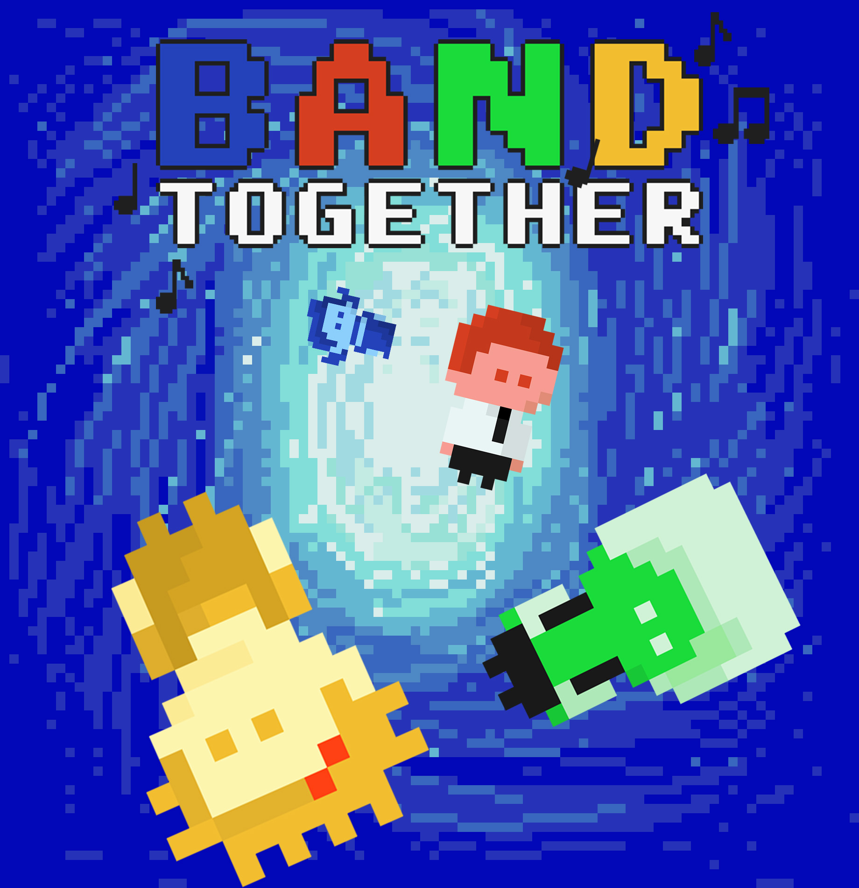

# Band Together [^1]

Band Together is a 2- to 4-player cooperative game made using the [p5.party↗](https://p5party.org/) library.

## Instructions

You are part of a group of musicians who are mysteriously transported back to the site of your first concert together.
Figure out how to return to the present, or remain forever trapped in a symphony of time!

Explore the room using WASD or arrow keys, unlock clues by interacting with items around you, solve the puzzle, and escape with your team before time runs out to win!

### [CLICK HERE↗](https://charogerz.github.io/BandTogether/src/index.html) TO PLAY AND EXPLORE!

## Visuals

 &nbsp;  &nbsp; 

   

## External Assets

### Fonts

- Typeface: QUINQUEFIVE
  - designed by [GGBotNet↗](https://www.ggbot.net/)
  - Download QUINQUEFIVE [here↗](https://ggbot.itch.io/quinquefive-font)
  - License: SIL Open Font License, Version 1.1

### Audio

- Guitar SFX
  - From: [TV Girl - Lovers Rock (EASY SLOW Guitar Tabs & chords Tutorial)↗](https://youtu.be/eZhSvUd1o2o?si=xprSYf03K2XAD6ba)
- Piano SFX
  - From: [YouTube Piano - Play It With Your Computer Keyboard↗](https://youtu.be/3gZC5763wYk?si=g9tvA-4655ZMNUYE)
- Trumpet SFX
  - From: [YouTube Trumpet - Play Trumpet with computer Keyboard↗](https://youtu.be/xa17zHJhNhA?si=N5ctGNsioYnueP_6)

## Team Members

**Charlotte Rogers** Available on Github @ [charogerz↗](https://github.com/charogerz)\
**Chloe Yiu** Available on Github @ [yiuchl↗](https://github.com/yiuchl)\
**Emma Wu** Available on Github @ [ewwamu↗](https://github.com/ewwamu)

[^1]: _Made for Spring 2024 Collab: P5 Party by Charlotte Rogers, Chloe Yiu, and Emma Wu_
